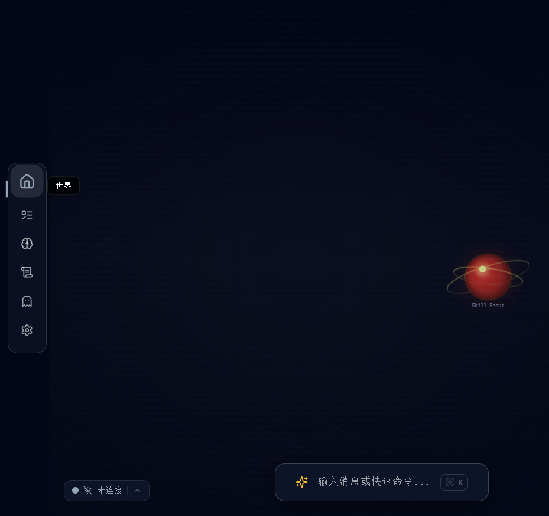
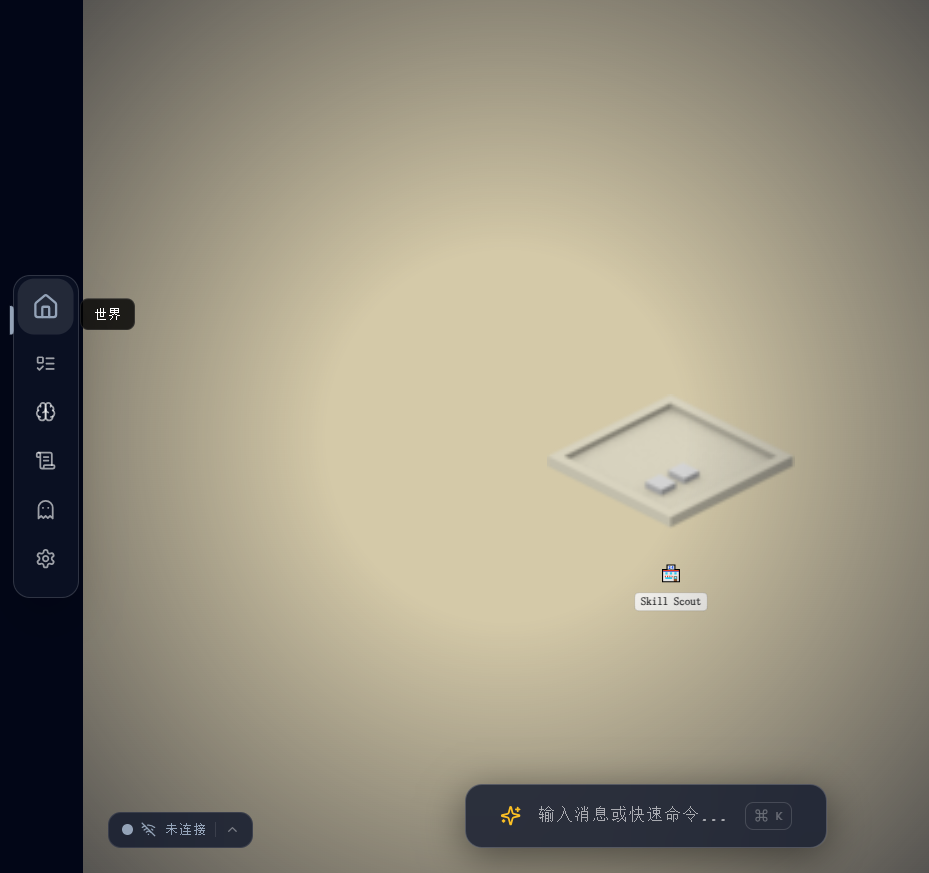
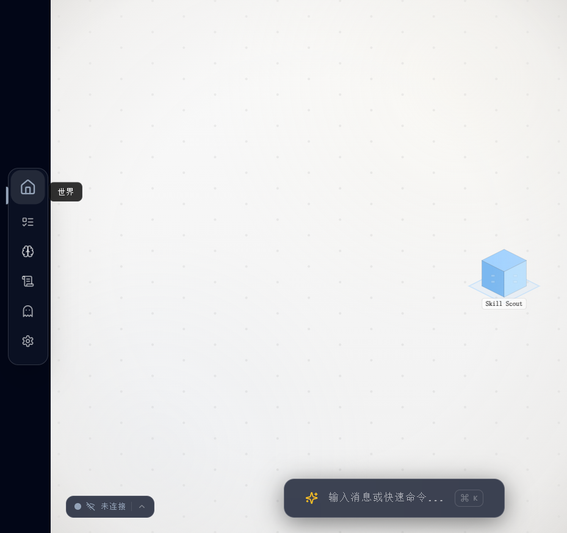
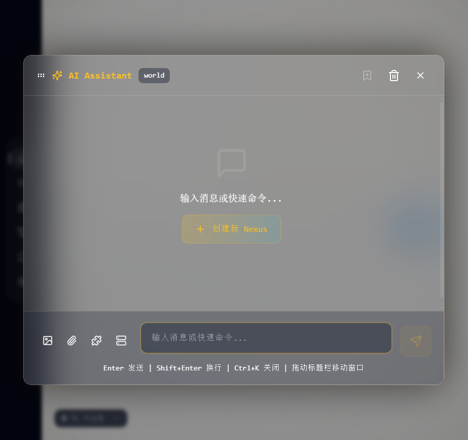
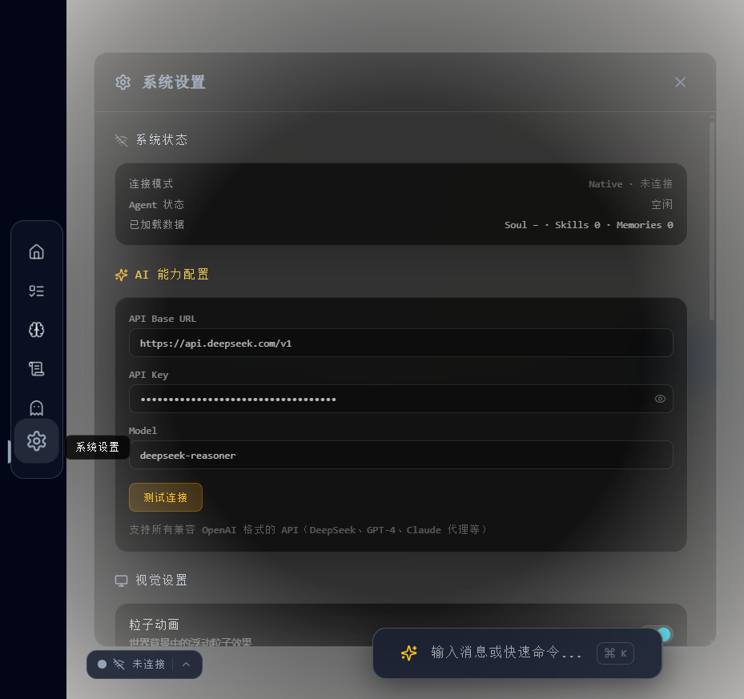

<div align="center">

# DD-OS

### Digital Dimension Operating System

*Build your LLM-driven world. Shatter the chatbox.*

[GitHub](https://github.com/FatBy/DD-OS) | [Skills Hub](https://github.com/FatBy/DD-OS/tree/main/skills)

</div>

---



**DD-OS** is a gamified AI operating system that runs locally. It reimagines the traditional chatbot interface as an immersive "digital world" where every AI skill and workflow is a building or a planet. Powered by a built-in ReAct execution engine, it supports multi-step task planning and autonomous execution.

---

## Features

### World Themes

DD-OS offers multiple immersive world views, switchable in Settings.

| Theme | Style | Preview |
|-------|-------|---------|
| **Cosmos** | Deep space planets, orbital connections, nebula particles |  |
| **Cityscape** | Isometric pixel city with Kenney-style tile rendering |  |
| **Minimalist** | Floating particles, breathing glow, clean block buildings |  |

---

### Nexus System -- Evolvable AI Workflow Nodes

Each Nexus is an executable AI workflow node with its own skill bindings, SOP definitions, and experience records.

- **Level Progression**: Earn XP on each execution; visual upgrades on level-up
- **Skill Binding**: Bind multiple SKILLs to compose complex workflows
- **Independent Chat**: Each Nexus has its own conversation context
- **SOP Memory**: Save standard operating procedures for consistent execution
- **Experience Accumulation**: Success/failure history continuously optimizes strategy
- **Custom Model**: Assign different LLMs to different Nexuses

---

### AI Chat -- ReAct Execution Engine

Built-in ReAct (Reasoning + Acting) loop engine for multi-step task planning and execution.



- **Task Planning**: Automatically decomposes complex tasks into executable sub-steps
- **Tool Calling**: File I/O, shell commands, web search, weather, and more
- **Reflexion**: Automatic reflection and retry on tool failure
- **Critic Verification**: Auto-validates results after file modifications
- **Dangerous Operation Approval**: High-risk commands require user confirmation
- **Quick File Access**: One-click copy path or open folder after file generation

---

### Five Core Modules

| Module | Description |
|--------|-------------|
| **Task House** | View running/completed tasks with real-time execution steps |
| **Skill House** | Manage loaded SKILLs, AI ability radar chart analysis |
| **Memory House** | Adventure logs, memory playback, AI narrative generation |
| **Soul Tower** | AI personality config (SOUL.md), core values and behavior boundaries |
| **World View** | Nexus node map with drag interaction and theme switching |

---

## Quick Start

### Requirements

| Dependency | Version |
|------------|---------|
| Node.js | >= 18 (v20+ recommended) |
| Python | >= 3.10 |
| Git | Latest |

### Step 1: Clone

```bash
git clone https://github.com/FatBy/DD-OS.git
cd DD-OS
```

### Step 2: Install Dependencies

```bash
# Frontend
npm install

# Python (optional, for YAML support)
pip install pyyaml
```

### Step 3: Launch

Open two terminal windows:

**Terminal 1 -- Start backend:**

```bash
# Windows
python ddos-local-server.py --path ~/.ddos --port 3001

# macOS / Linux
python3 ddos-local-server.py --path ~/.ddos --port 3001
```

**Terminal 2 -- Start frontend:**

```bash
npm run dev
```

Open **http://localhost:5173** in your browser.

> On first launch, DD-OS automatically creates a data directory at `~/.ddos/`.

---

## API Configuration

DD-OS requires an LLM API connection for AI features. Any OpenAI-compatible API is supported.



### Setup Steps

1. Launch DD-OS and click the **Settings** icon on the left sidebar
2. Under **AI Configuration**, fill in:

| Field | Description | Example |
|-------|-------------|---------|
| **Base URL** | API endpoint | `https://api.openai.com/v1` |
| **Model** | Model name | `gpt-4o` / `deepseek-chat` |
| **API Key** | Your API key | `sk-xxxxxxxx` |

### Supported API Providers

| Provider | Recommended Models | Base URL |
|----------|-------------------|----------|
| OpenAI | gpt-4o, gpt-4o-mini | `https://api.openai.com/v1` |
| DeepSeek | deepseek-chat, deepseek-reasoner | `https://api.deepseek.com/v1` |
| Moonshot | moonshot-v1-8k | `https://api.moonshot.cn/v1` |
| Zhipu AI | glm-4-flash | `https://open.bigmodel.cn/api/paas/v4` |
| SiliconFlow | Various open-source models | `https://api.siliconflow.cn/v1` |

---

## Skill System

### Built-in Tools

| Tool | Description |
|------|-------------|
| `readFile` / `writeFile` | File I/O with one-click open after generation |
| `runCmd` | Shell command execution (with safety approval) |
| `webSearch` | Web search |
| `webFetch` | Fetch web page content |
| `weather` | Weather query |
| `saveMemory` / `searchMemory` | Memory storage and retrieval |
| `openInExplorer` | Open file in system file manager |

### Custom Skills

Create a directory under `~/.ddos/skills/` with a `SKILL.md` file:

```
~/.ddos/skills/my-skill/SKILL.md
```

```markdown
---
name: my-skill
description: My custom skill
version: 1.0.0
---

# Instructions

What this skill does and how it works...
```

DD-OS hot-reloads new skills automatically -- no restart needed.

---

## Data Directory

```
~/.ddos/
├── SOUL.md              # AI personality config
├── skills/              # Skill definitions (SKILL.md)
│   ├── skill-scout/
│   └── my-skill/
├── nexuses/             # Nexus workflow data
├── memory/              # Memory files
└── logs/                # Conversation logs
```

---

## Architecture

```
  GitHub / Slack / Notion / Chrome / Local Bash
               |
               v   (MCP Standard Protocol)
  +-------------------------------+
  |     ddos-local-server.py      |  <-- Tool Execution Layer
  |      (Python / MCP Host)      |
  +---------------+---------------+
                  |  (HTTP REST API)
  +---------------+---------------+
  |      ReAct Execution Engine   |  <-- Task Orchestration Layer
  |   (LocalClawService.ts)       |
  +---------------+---------------+
                  |
       [LLM API: GPT-4o / DeepSeek / ...]  <-- Intelligence Layer
```

---

## Tech Stack

| Layer | Technology |
|-------|-----------|
| Frontend | React + TypeScript + Vite + Zustand + Tailwind CSS + Framer Motion |
| Rendering | Canvas 2D (GameCanvas engine) |
| Backend | Python (ddos-local-server.py) |
| Protocol | HTTP REST API |

---

## Security

- All API keys are stored in browser localStorage and never uploaded to any server
- Backend binds to `127.0.0.1` by default (localhost only)
- Dangerous commands (e.g. `rm -rf`, `format`) trigger an approval dialog
- Run `python ddos-local-server.py --doctor` to check security configuration

---

## License

MIT
