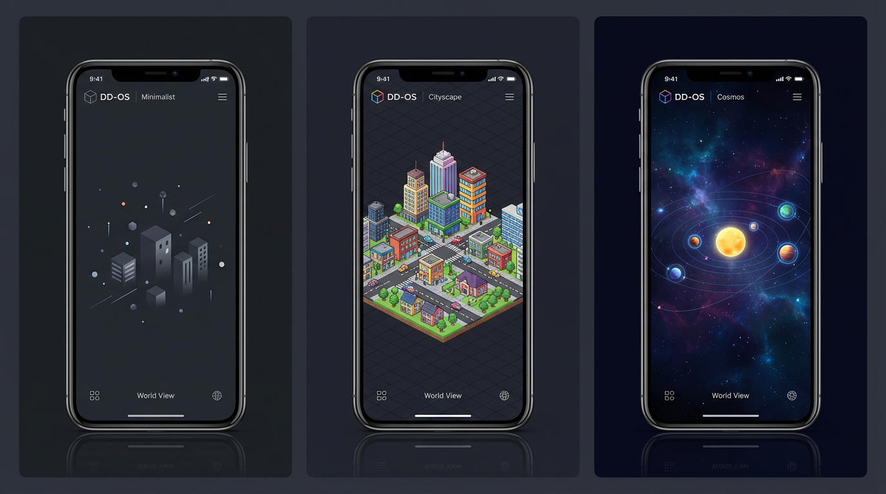

<div align="center">

#   DD-OS

### Digital Dimension Operating System

*Build your LLM-driven world. Shatter the chatbox.*

[GitHub](https://github.com/FatBy/DD-OS) | [Skills Hub](https://github.com/FatBy/DD-OS/tree/main/skills)

</div>

---


**DD-OS** 是一个运行在本地的游戏化 AI 操作系统。它将传统的聊天机器人界面重新定义为沉浸式的「数字世界」，每个 AI 技能和工作流都是世界中的一座建筑或一颗星球。内置 ReAct 执行引擎，支持多步骤任务自动规划与执行。

---

## 产品特色

### 三大世界主题

DD-OS 提供三种沉浸式世界视图，可在设置中一键切换。



| 主题 | 风格 | 特色 |
|------|------|------|
| **Minimalist** | 极简几何 | 浮动粒子、呼吸光效、简洁方块建筑，适合专注工作 |
| **Cityscape** | 等轴像素城市 | Kenney 风格瓦片渲染、道路网络、树木装饰 |
| **Cosmos** | 宇宙星图 | 行星节点、轨道连线、星云粒子 |

---

### Nexus 系统 -- 可进化的 AI 工作流节点

每个 Nexus 是一个可执行的 AI 工作流节点，拥有独立的技能绑定、SOP 定义和经验记录。


- **等级成长**: 每次执行获得 XP，等级提升后视觉外观升级
- **技能绑定**: 可绑定多个 SKILL，组合成复杂工作流
- **独立对话**: 每个 Nexus 拥有专属对话上下文
- **SOP 记忆**: 保存标准操作流程，确保执行一致性
- **经验积累**: 成功/失败经验持续优化执行策略
- **自定义模型**: 可为不同 Nexus 配置不同的 LLM

---

### 智能对话 -- ReAct 执行引擎

内置 ReAct (Reasoning + Acting) 循环执行引擎，支持多步骤任务自动规划与执行。


- **任务规划**: 自动拆解复杂任务为可执行子步骤
- **工具调用**: 文件读写、命令执行、网页搜索、天气查询等
- **Reflexion 机制**: 工具执行失败时自动反思重试
- **Critic 验证**: 文件修改后自动校验结果
- **危险操作审批**: 高风险命令需用户确认才能执行
- **文件快速访问**: 生成文件后一键复制路径或打开文件夹

---

### 五大功能模块

| 模块 | 说明 |
|------|------|
| **Task House** (任务看板) | 查看执行中/已完成的任务，实时展示执行步骤 |
| **Skill House** (技能树) | 管理已加载的 SKILL，AI 能力雷达图分析 |
| **Memory House** (记忆宫殿) | 冒险日志、记忆回放、AI 叙事生成 |
| **Soul Tower** (灵魂塔) | AI 人格配置 (SOUL.md)，核心价值观和行为边界 |
| **World View** (世界视图) | Nexus 节点地图，拖拽交互，主题切换 |

---

## 快速开始

### 环境要求

| 依赖 | 版本 |
|------|------|
| Node.js | >= 18 (推荐 v20+) |
| Python | >= 3.10 |
| Git | 最新版 |

### 第 1 步: 下载项目

```bash
git clone https://github.com/FatBy/DD-OS.git
cd DD-OS
```

### 第 2 步: 安装依赖

```bash
# 前端依赖
npm install

# Python 依赖 (可选，如需 YAML 支持)
pip install pyyaml
```

### 第 3 步: 一键启动

需要开两个终端窗口：

**终端 1 - 启动后端服务:**

```bash
# Windows
python ddos-local-server.py --path ~/.ddos --port 3001

# macOS / Linux
python3 ddos-local-server.py --path ~/.ddos --port 3001
```

**终端 2 - 启动前端:**

```bash
npm run dev
```

浏览器打开 **http://localhost:5173** 即可进入 DD-OS。

> 首次启动时，DD-OS 会自动在 `~/.ddos/` 目录下创建数据文件夹。

---

## 配置 API

DD-OS 需要连接 LLM API 才能使用 AI 功能。支持任何 OpenAI 兼容的 API。

### 操作步骤

1. 启动 DD-OS 后，点击左下角的 **连接图标**
2. 选择 **Native** 模式
3. 在 LLM 配置中填写：

| 配置项 | 说明 | 示例 |
|--------|------|------|
| **Base URL** | API 服务地址 | `https://api.openai.com/v1` |
| **Model** | 模型名称 | `gpt-4o` / `deepseek-chat` |
| **API Key** | 你的 API 密钥 | `sk-xxxxxxxx` |

### 支持的 API 服务

| 服务商 | 推荐模型 | Base URL |
|--------|---------|----------|
| OpenAI | gpt-4o, gpt-4o-mini | `https://api.openai.com/v1` |
| DeepSeek | deepseek-chat, deepseek-reasoner | `https://api.deepseek.com/v1` |
| 月之暗面 | moonshot-v1-8k | `https://api.moonshot.cn/v1` |
| 智谱 AI | glm-4-flash | `https://open.bigmodel.cn/api/paas/v4` |
| 硅基流动 | 各类开源模型 | `https://api.siliconflow.cn/v1` |

配置完成后，DD-OS 会自动连接后端并加载技能、记忆、灵魂数据。

---

## 技能系统

### 内置工具

| 工具 | 说明 |
|------|------|
| `readFile` / `writeFile` | 文件读写，生成文件后可一键打开 |
| `runCmd` | 命令行执行 (带安全审批) |
| `webSearch` | 网页搜索 |
| `webFetch` | 获取网页内容 |
| `weather` | 天气查询 |
| `saveMemory` / `searchMemory` | 记忆存储与检索 |
| `openInExplorer` | 在文件管理器中打开文件 |

### 自定义技能

在 `~/.ddos/skills/` 下创建目录，编写 `SKILL.md`：

```
~/.ddos/skills/my-skill/SKILL.md
```

```markdown
---
name: my-skill
description: 我的自定义技能
version: 1.0.0
---

# 使用说明

这个技能的用途和操作流程...
```

保存后 DD-OS 会自动热加载新技能，无需重启。

---

## 数据目录

```
~/.ddos/
├── SOUL.md              # AI 人格配置
├── skills/              # 技能定义 (SKILL.md)
│   ├── skill-scout/
│   └── my-skill/
├── nexuses/             # Nexus 工作流数据
├── memory/              # 记忆文件
└── logs/                # 对话日志
```

---

## 架构概览

```
  GitHub / Slack / Notion / Chrome / Local Bash
               |
               v   (MCP Standard Protocol)
  +-------------------------------+
  |     ddos-local-server.py      |  <-- 工具执行层
  |      (Python / MCP Host)      |
  +---------------+---------------+
                  |  (HTTP REST API)
  +---------------+---------------+
  |      ReAct Execution Engine   |  <-- 任务编排层
  |   (LocalClawService.ts)       |
  +---------------+---------------+
                  |
       [LLM API: GPT-4o / DeepSeek / ...]  <-- 智能层
```

---

## 技术栈

| 层 | 技术 |
|----|------|
| 前端 | React + TypeScript + Vite + Zustand + Tailwind CSS + Framer Motion |
| 渲染 | Canvas 2D (GameCanvas 渲染引擎) |
| 后端 | Python (ddos-local-server.py) |
| 协议 | HTTP REST API |

---

## 安全说明

- 所有 API Key 存储在浏览器 localStorage 中，不会上传到任何服务器
- 后端默认绑定 `127.0.0.1`，仅本机可访问
- 危险命令 (如 `rm -rf`、`format`) 会触发审批弹窗，需用户确认
- 运行 `python ddos-local-server.py --doctor` 可检查安全配置

---

## License

MIT
